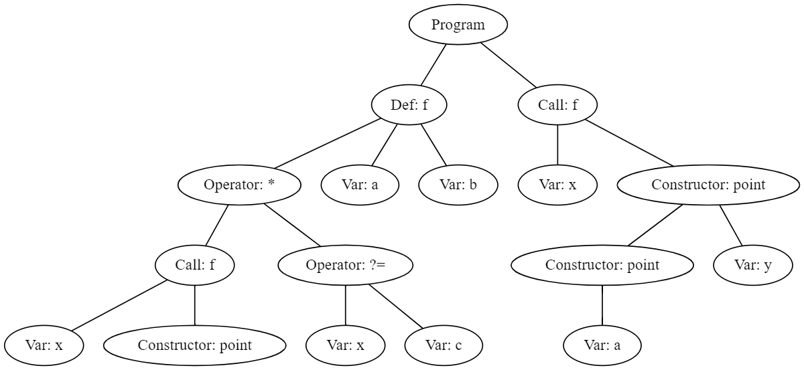

# Проект

Цель работы заключалась в создании конкретного синтаксиса по абстрактному синтаксису для языка M и написании синтаксического анализатора, строящего синтаксическое дерево.

## Задачи

### Синтаксический анализатор

* Парсер должен быть встроен в консольное приложение, принимающее на вход путь к входному файлу.
* В результате работы парсера на некорректном входе пользователь должен получить цивилизованное сообщение об ошибке (пробросить исключение наружу — плохая идея).
* В результате работы парсера на корректном входе должно получаться абстрактное синтаксическое дерево, которое соответствует описанию *абстрактного* синтаксиса. Его можно либо вывести в консоль, либо сохранить в файл — как удобнее.
* Можно использовать любые инструменты и любой язык программирования для написания парсера.
* Код обязательно сопроводить инструкцией по сборке/запуску.
* Обязательно реализовать тесты.

### Абстрактный синтаксис языка M

#### Программы

Программой на языке M является возможно пустая последовательность определений отношений и одна цель.

#### Определение отношения

Любое отношение содержит имя отношения, список ее аргументов и тело. Телом отношения является некоторая цель.

#### Атом

Атом это либо переменная, либо некоторый конструктор, примененный к возможно пустой последовательности атомов.

#### Цель

Существует несколько типов целей:

* Унификация двух атомов.
* Конъюнкция двух целей.
* Дизъюнкция двух целей.
* Вызов отношения по имени. Аргументами отношения может быть потенциально пустая последовательность атомов.

### Создание конкретного синтаксиса

Предложить конкретный синтаксис для абстрактного синтаксиса.

* Необходимо описать, как конкретно следует писать программы на вашем языке
   * Как выглядят идентификаторы, литералы, ключевые слова.
   * Какую роль играют пробельные символы.
   * Как выглядят комментарии.
   * Как именно описываются бинарные операторы, определения, последовательности.
* Описание конкретного синтаксиса должно быть максимально однозначным.
* Конкретный синтаксис должен быть описан человекочитаемо: грамматика для yacc, конечно,
специфицирует конкретный синтаксис, но лучше все-таки добавить подробностей и объяснений, что именно вы хотели ею выразить. Целесообразно привести примеры программ.
* Конкретный синтаксис может быть вообще любым, но учитывайте, что парсить этот язык вам же.

## Описание конкретного синтаксиса языка M

### Идентификаторы, литералы, ключевые слова

- Идентификаторы
Непустая последовательность символов типа `char`, в начале стоит хотя бы один символ `char` из `[A-z]`, далее любая последовательность символов `char` из `[0-9|A-z]`.
Для идентификаторов отношений в начале стоит `#`, для идентификаторов конструкторов в начале стоит `%`.
- Ключевые слова
`define` -- следом идет определения отношения
`do` -- следом идет цель
`for` -- следом через пробел перечисляются аргументы отношения
`make` -- следом через пробел идет идентификатор конструктора
`from` -- следом через пробел перечисляются аргументы конструктора
- Литералы
В этом языке их нет :)

### Пробельные символы
Идентификаторы не могут содержать пробелы.

### Комментарии
`||` символы, после которых можно написать комментарий, комментарии только однострочные -- до конца строки

### Бинарные операторы, определения, последовательности
#### Определение отношения
Ключевое слово `define`,  далее идентификатор -- название отношения с `#` в начале, далее `do`, далее тело (см. цель), далее `for`, далее через пробел аргументы функции.

#### Бинарные операторы
- Унификация обозначается `?=` 
- Конъюнкция обозначается `*`
- Дизъюнкция обозначается `+`
#### Конструкторы
Имеют следующий вид: `make`, далее идентификатор конструктора с приписанным `%` в начале, далее `from` и далее аргументы через пробел, если  аргумент -- конструктор, то он заключается в круглые скобки.
#### Цель
Аргументами отношения при вызове его в цели могут быть только литералы или конструкторы, не идентификаторы.
`x ?= (make %Something from y)` -- унификация двух атомов, атом-конструктор заключается в скобки
`(x ?= (make %Something from y)) * (x ?= y)`-- конъюнкция двух целей
`(x ?= (make %Something from y)) + (x ?= y)` -- дизъюнкция двух целей
`do #someFunc for x (make %Something)`-- вызов отношения по имени при наличии аргументов -- литерал и конструктор без аргументов, конструктор заключается в скобки
`do #someFunc` -- вызов отношения по имени при отсутствии аргументов
`do #someFunc for x (make %Something from y (make %Something))` -- вызов отношения по имени, когда в аргументе есть вложенные конструкторы, тогда каждый конструктор заключается в круглые скобки

## Библиотеки

Для написания парсера использовалась библиотека `ply`: `ply.lex`, `ply.yacc`, для генерации дерева использовалась библиотека `graphviz`.

[Реализация лексера](lex.py)

[Реализация парсера](parse.py)

### Запуск:
``` bash
python parse.py название_входного_файла.txt
```

## Тесты, примеры программ на языке M и их синтаксические деревья

#### Программа
```
define #f do (do #f for x (make %point)) * (x ?= c) for a b  
|| определили сложное рекурсивное отношение  
|| отношение принимает два аргумента, но использует только один из них  
do #f for x (make %point from (make %point from a) y)  
|| цель с вызовом отношения cо сложным аргументом со вложенным конструктором
```
[Входной файл](test1.txt)

[Вывод с описанием графа](test1.txt.graph)

#### Синтаксическое дерево
